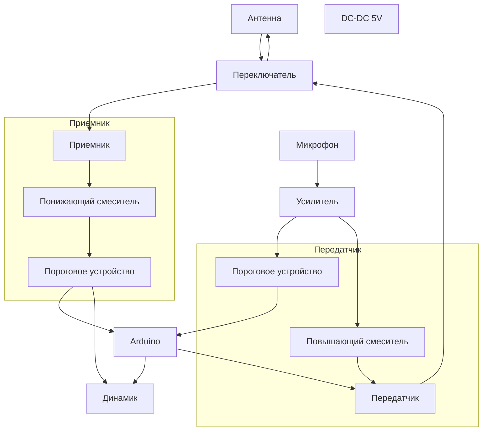

# walkie-talkie
Делаем рацию на 433,92 МГц (LPD диапазон)

# Задача
Необходимо реализовать следующий функционал:
1. Разделение каналов по частотам
2. Разделение каналов по группам
3. Пороговое устройство (и на передачу и на прием)

# Реализация

# Компоненты
- Питание от 9В кроны через [DC-DC преобразователь](https://amperkot.ru/products/dcdc_preobrazovatel_ponizhayuschiy_lm2596s/24022294.html) на 5 вольт.  
- Передача и прием осуществляются переделанными [радиомодулями](https://amperkot.ru/products/radiomoduli_433mhz_peredatchik_mxfs03v_i_priemnik_mx05v/23869814.html) ([Видео](https://www.youtube.com/watch?v=o1lduXJH_W4&ab_channel=ZAFERYILDIZ)).  
- Логика реализована на [ардуинке](https://amperkot.ru/products/plata_nano_v_30__arduinosovmestimaya/23813247.html).  
- [Микрофон](https://amperkot.ru/products/elektretnyiy_mikrofon_6x5mm_emb6050ul_52d/24145498.html)
- [Усилитель микрофона](Усилитель%20микрофона.md)
