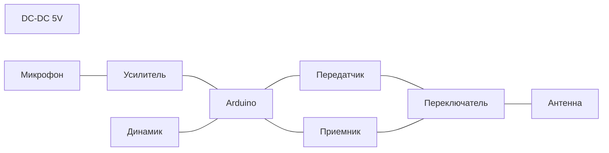

```mermaid
flowchart LR
  antenna["Антенна"]
  switch["Переключатель"]
  voltahe_source["DC-DC 5V"]
  arduino["Arduino"]
  transmitter["Передатчик"]
  receiver["Приемник"]
  amplifier["Усилитель"]
  micro["Микрофон"]
  speaker["Динамик"]
  micro --- amplifier
  amplifier --- arduino
  arduino --- transmitter
  arduino --- receiver 
  speaker --- arduino 
  transmitter --- switch
  receiver --- switch
  switch --- antenna
```

